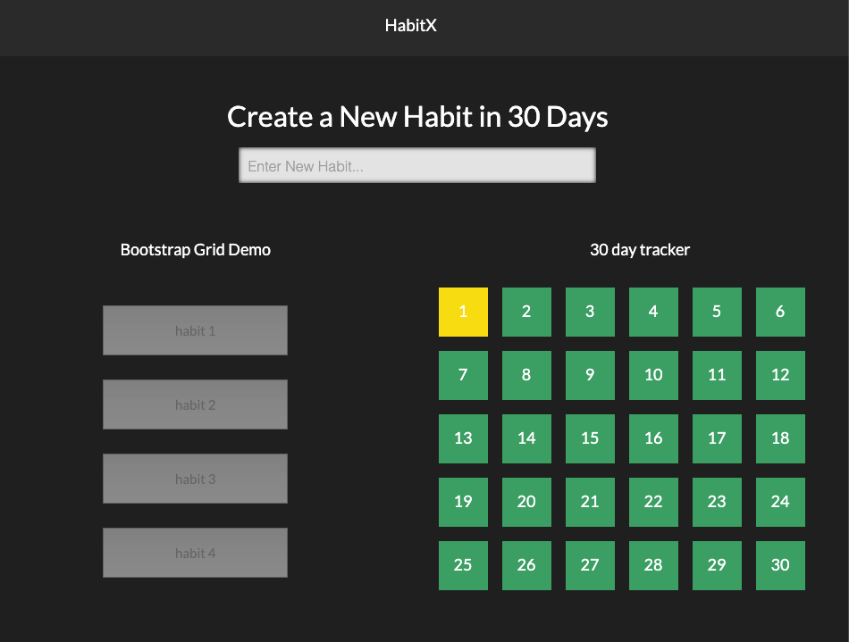

# HabitX
a reusable habit tracker utilizing the base of Xeffect to establish or break habits over 30 day periods 

### Mock Layout

### Author: Bisraddesign (Brad Thompson)

## User Story 

## Programming 

Utilized Bootstrap4, Jquery, Html, css

## Deployment Link

<https://bisrad.github.io/>

## Credits:

- 

## Rescorces:

- API documentation <>